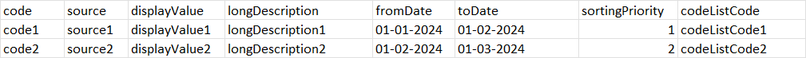

# Genesis Rest APIs

### Switching property files
    * --spring.profiles.active=dev
 
### Swagger
    
     http://localhost:8080/genesis/swagger-ui.html

### Actuator

    http://localhost:8080/genesis/actuator

### H2 Database console

    http://localhost:8080/genesis/h2

## Run application

    mvn spring-boot:run

### Reference Documentation

## Add records

### request

`POST /genesis/api/v1/csv`

    http://localhost:8080/genesis/api/v1/csv

    upload CSV file with 
    [key: "file", value: exercise.csv]


sample payload: 


|  code  |  source  |  displayValue  |  longDescription  |  fromDate   |   toDate    | sortingPriority |  codeListCode  |
|:------:|:--------:|:--------------:|:-----------------:|:-----------:|:-----------:|:---------------:|:--------------:|
| code1  | source1  | displayValue1  | longDescription1  | 01-01-2024  | 01-02-2024  |       1         | codeListCode1  |
| code2  | source2  | displayValue2  | longDescription2  | 01-02-2024  | 01-03-2024  |        2        | codeListCode2  |

```
CSV:
code,source,displayValue,longDescription,fromDate,toDate,sortingPriority,codeListCode
code1,source1,displayValue1,longDescription1,01-01-2024,01-02-2024,1,codeListCode1
code2,source2,displayValue2,longDescription2,01-02-2024,01-03-2024,2,codeListCode2
```


## Fetch by code

### request

`GET /genesis/records/{code}`

    curl -i -H 'Accept: application/json' http://localhost:8080/genesis/api/v1/csv/records/1

## Fetch all data

### request

`GET genesis/api/v1/csv/records`

    curl -i -H 'Accept: application/json' http://localhost:8080/genesis/api/v1/csv/records

## Delete by record id

### request 

`DELETE /genesis/records/{recordId}`

    http://localhost:8080/genesis/api/v1/csv/records/1

## Delete all

### request

`DELETE /genesis/records`

    http://localhost:8080/genesis/api/v1/csv/records


