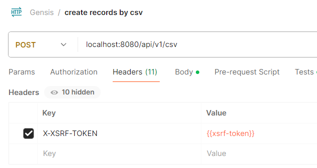

## Genesis Rest APIs

### Setup

1. (pre-check) Project has been configured in Java 17 (Add Java env variables)
2. Update gradle dependencies
3. Run postgres db `docker-compose -f .\docker-compose.yml up -d`
3. Go to GenesisApplication and run application
4. or from root directory run `./gradlew bootRun`

### Genesis Application Functions

### Add records

### request

`POST /api/v1/csv`

    http://localhost:8080/api/v1/csv

    upload CSV file with 
    [key: "file", value: exercise.csv]

Sample payload CSV
```
code,source,displayValue,longDescription,fromDate,toDate,sortingPriority,codeListCode
code1,source1,displayValue1,longDescription1,01-01-2024,01-02-2024,1,codeListCode1
code2,source2,displayValue2,longDescription2,01-02-2024,01-03-2024,2,codeListCode2
```


|  code  |  source  |  displayValue  |  longDescription  |  fromDate   |   toDate    | sortingPriority |  codeListCode  |
|:------:|:--------:|:--------------:|:-----------------:|:-----------:|:-----------:|:---------------:|:--------------:|
| code1  | source1  | displayValue1  | longDescription1  | 01-01-2024  | 01-02-2024  |       1         | codeListCode1  |
| code2  | source2  | displayValue2  | longDescription2  | 01-02-2024  | 01-03-2024  |        2        | codeListCode2  |

### Get all records

`GET /api/v1/csv/records`

`GET /api/v1/csv/records?limit=1&offset=1`

    curl -i -H 'Accept: application/json' http://localhost:8080/api/v1/csv/records

### Get record by code

`GET /records/{code}`

    curl -i -H 'Accept: application/json' http://localhost:8080/api/v1/csv/records/1

### Delete by record id

`DELETE /records/{recordId}`

    http://localhost:8080/api/v1/csv/records/1

### Delete all

`DELETE /records`

    http://localhost:8080/api/v1/csv/records

## Security Config

### Post requests

- POST Requests requires to set X-XSRF-TOKEN in header
- XSRF-TOKEN can be fetched from response cookies, 
this cookie can be readable via Javascript since HTTP-ONLY set to false

### Postman script to optimize XSRF-TOKEN to be fetched from cookie
```
var xsrfCookie = postman.getResponseCookie("XSRF-TOKEN");
postman.setEnvironmentVariable("xsrf-token", xsrfCookie.value);
```


## Additional information

### Switching property files
    * --spring.profiles.active=dev

### Swagger

     http://localhost:8080/swagger-ui.html

### Actuator

    http://localhost:8080/actuator

### H2 Database console

    http://localhost:8080/h2

